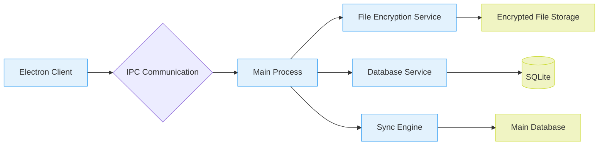
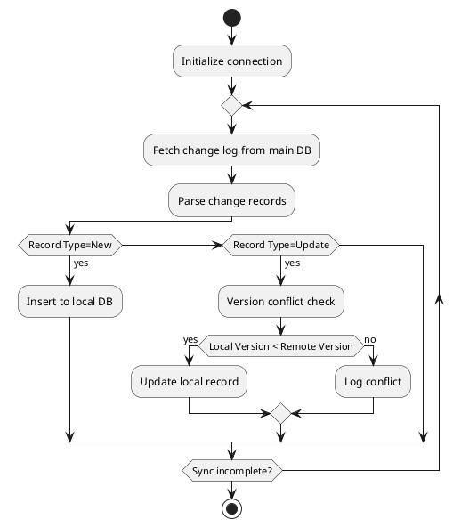
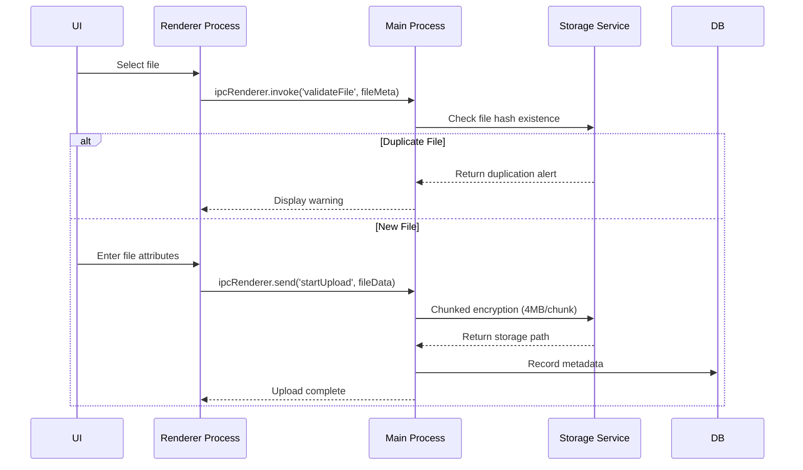

# Fixed Asset Attachment Management System Requirements Specification (Electron Edition)

## 1. Introduction

### 1.1 Project Background

- **Current Status Analysis**: The existing WARP system exhibits two critical deficiencies in document management:

  1. The supporting documents for fixed assets are missing. Some key materials are only stored in the personal computers of the personnel in the corresponding fixed assets team. There is no backup on the shared disk or in the cloud, and there is no detailed description. These materials are prone to being lost, making it difficult to trace the specific situation.
  2. There is no hierarchical management and control for confidential documents. All attached documents are open to all users.

### 1.2 System Positioning

- **Core Value**: Establish a "Double Protection" document management framework
  - Loss Prevention: Dual backup mechanism (local + cloud)
  - Leakage Prevention: Military-grade encryption (AES-256+RSA-2048)

## 2. System Architecture

### 2.1 Technical Architecture Diagram



### 2.2 Electron Architecture Design

- **Process Model**:
  ```ts
  // Main process architecture example
  app.whenReady().then(() => {
    initializeDBService({
      encryptionKey: secureStorage.getKey(),
      autoVacuum: true
    });

    createMainWindow({
      webPreferences: {
        nodeIntegration: false,
        contextIsolation: true,
        sandbox: true
      }
    });
  });
  ```

## 3. Detailed Functional Requirements

### 3.1 Data Synchronization Service

#### 3.1.1 Incremental Sync Mechanism



#### 3.1.2 Performance Metrics

| Metric            | Target Value        | Measurement Method            |
| ----------------- | ------------------- | ----------------------------- |
| Full Sync Time    | ≤30min (50k items) | JMeter stress test            |
| Incremental Delay | ≤5 minutes         | Timestamp difference analysis |
| Network Recovery  | Auto-reconnect (3x) | Simulated network jitter test |

### 3.2 File Management Module

#### 3.2.1 File Upload Workflow



#### 3.2.2 Storage Path Design

```bash
/var/lib/asset-attachments/
├── public/
│   └── YYYYMM/
│       └── assetID_filehash.ext
├── confidential/
│   └── encrypted/
│       └── filehash.aes
└── temp/
    └── sessionID_chunk.tmp
```

### 3.3 Security Control Scheme

#### 3.3.1 Encryption Matrix

| Security Level | Algorithm   | Key Management               | Access Control               |
| -------------- | ----------- | ---------------------------- | ---------------------------- |
| Public         | None        | -                            | All authenticated users      |
| Internal       | AES-128-GCM | System master key encryption | Department-level permissions |
| Confidential   | AES-256-CBC | User private key (RSA-2048)  | 2FA + approval required      |

#### 3.3.2 Audit Log Specification

```ts
interface AuditLog {
  timestamp: string;      // ISO8601 timestamp
  userId: string;         // Unique user ID
  actionType: 'VIEW' | 'DOWNLOAD' | 'DELETE';
  targetId: string;       // Asset/File ID
  sourceIP: string;       // IPv4/IPv6 address
  deviceFingerprint: string; // Device fingerprint hash
  result: 'SUCCESS' | 'FAIL';
  detail?: string;        // Error details
}
```

## 4. Non-Functional Requirements

### 4.1 Performance Metrics

| Scenario               | Concurrent Users | Response Time | Reliability          |
| ---------------------- | ---------------- | ------------- | -------------------- |
| File Upload (<100MB)   | 10               | ≤30s         | 99% resume success   |
| Complex Query          | 100              | ≤2s          | 100% accuracy        |
| Bulk Export (50 items) | 10               | ≤60s         | Data integrity check |

### 4.2 Compatibility Requirements

**OS Support Matrix**:

| Platform | Version Requirement | Architecture        |
| -------- | ------------------- | ------------------- |
| Windows  | 10 21H2+            | x64/ARM64           |
| macOS    | Monterey 12.3+      | Intel/Apple Silicon |

## 5. Deployment Plan

### 5.1 Production Configuration

```yaml
# electron-builder config
appId: com.company.assetattachments
asar: true
files:
  - "dist/**/*"
  - "!**/*.map"
extraResources:
  - from: "resources/"
    to: "app-resources"
win:
  target: ["nsis"]
  icon: "build/icon.ico"
mac:
  target: ["dmg"]
  category: public.app-category.business
```

### 5.2 Update Strategy

1. **Delta Updates**: Implemented via `electron-updater`
2. **Security Verification**: Code signing + SHA-256 hash check
3. **Rollback Mechanism**: Maintain last 3 versions
4. **Release Channels**:
   - Internal Beta: Weekly builds
   - Stable: Monthly security updates
   - Hotfixes: CVE response (72hr patch)

## 6. Verification Criteria

### 6.1 Test Case Matrix

| Test Type      | Toolchain          | Coverage Target |
| -------------- | ------------------ | --------------- |
| Unit Testing   | Jest + Spectron    | ≥85%           |
| E2E Testing    | Cypress            | 100% core flows |
| Security Audit | OWASP ZAP + Nessus | Zero high-risk  |

### 6.2 Acceptance Criteria

1. **Functional Acceptance**:
   - Pass all test cases
   - UAT satisfaction ≥4.5/5
2. **Security Compliance**:
   - Third-party pentest approved
   - ISO 27001 certification achieved

---

**Note**: This document contains complete system requirements. The following advanced features are recommended for V2.0:

1. ML-based document classification (GPU acceleration required)
2. Blockchain notarization interface (Hyperledger Fabric)
3. Mobile collaboration support (React Native module)
