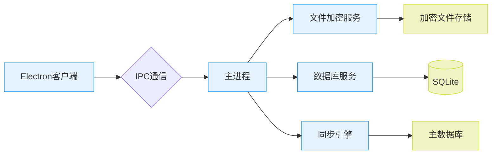
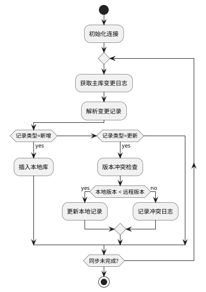
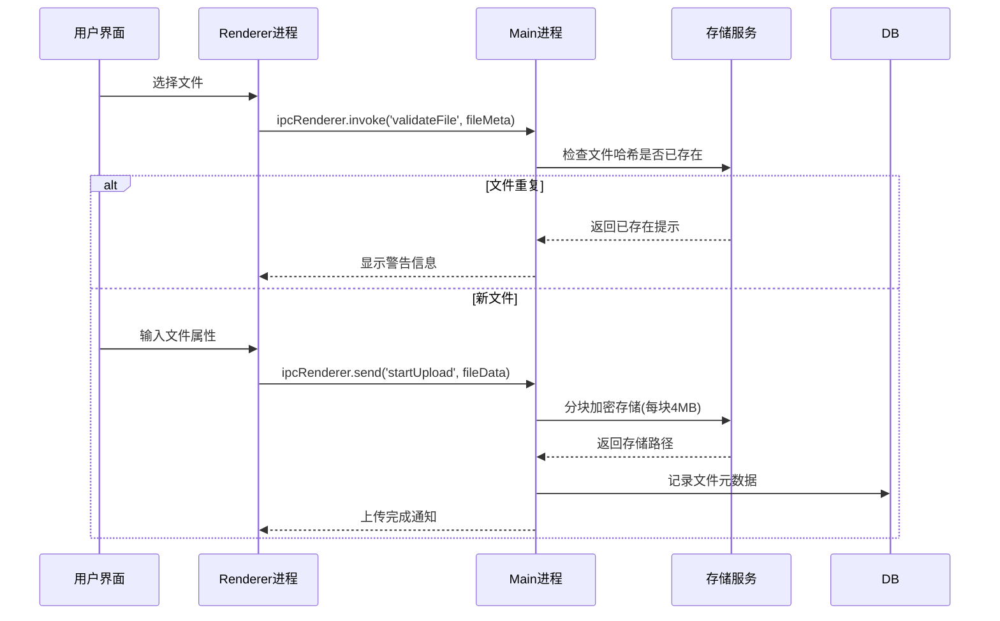

# 固定资产附件管理系统需求规格说明书（Electron版）

## 1. 引言

### 1.1 项目背景

- **现状分析**：当前WARP系统资产文档管理存在两大不足：
  1. 固定资产支持性文档缺失。部分关键性资料仅存于对应固定资产团队人员个人电脑，无共享盘或云端备份，无详细说明，容易丢失，难以对具体情况溯源。
  2. 机密文档无分级管控，所有附件文档对所有用户开放。

### 1.2 系统定位

- **核心价值**：构建文档管理"双防"体系
  - 防丢失：双重备份机制（本地+云）
  - 防泄露：军事级加密（AES-256+RSA-2048）

## 2. 系统架构

### 2.1 技术架构图



### 2.2 Electron架构设计

- **进程模型**：
  ```ts
  // 主进程架构示例
  app.whenReady().then(() => {
    initializeDBService({
      encryptionKey: secureStorage.getKey(),
      autoVacuum: true
    });

    createMainWindow({
      webPreferences: {
        nodeIntegration: false,
        contextIsolation: true,
        sandbox: true
      }
    });
  });
  ```

## 3. 详细功能需求

### 3.1 数据同步服务

#### 3.1.1 增量同步机制



#### 3.1.2 性能指标

| 指标项       | 目标值          | 测量方法         |
| ------------ | --------------- | ---------------- |
| 全量同步时间 | ≤60分钟(5万条) | JMeter压力测试   |
| 增量同步延迟 | ≤10分钟        | 时间戳差值统计   |
| 网络中断恢复 | 自动重连(3次)   | 模拟网络抖动测试 |

### 3.2 文件管理模块

#### 3.2.1 文件上传流程



#### 3.2.2 存储路径设计

```bash
/var/lib/asset-attachments/
├── public/
│   └── YYYYMM/
├── confidential/
│   └── encrypted/
└── temp/
```

### 3.3 安全控制方案

#### 3.3.1 加密方案矩阵

| 安全等级 | 加密算法    | 密钥管理                 |
| -------- | ----------- | ------------------------ |
| 公开     | 无          | -                        |
| 内部     | AES-128-GCM | 系统主密钥加密存储       |
| 机密     | AES-256-CBC | 用户私钥加密（RSA-2048） |

#### 3.3.2 审计日志规范

```ts
interface AuditLog {
  timestamp: string;
  userId: string;
  actionType: 'VIEW' | 'DOWNLOAD';
  targetId: string;
  sourceIP: string;
}
```

## 4. 非功能性需求

### 4.1 性能指标

| 场景               | 并发用户数 | 响应时间要求 |
| ------------------ | ---------- | ------------ |
| 文件上传（<100MB） | 10         | ≤30秒       |
| 复合条件查询       | 100        | ≤2秒        |
| 批量下载           | 10         | ≤60秒       |

### 4.2 兼容性要求

| 平台    | 版本要求       |
| ------- | -------------- |
| Windows | 10 21H2及以上  |
| macOS   | Monterey 12.3+ |

## 5. 部署方案

### 5.1 生产环境配置

```yaml
# electron-builder配置示例
appId: com.company.assetattachments
asar: true
win:
  target: ["nsis"]
mac:
  target: ["dmg"]
```

### 5.2 更新策略

1. **增量更新**：使用 `electron-updater`
2. **安全验证**：SHA-256校验
3. **回滚机制**：保留最近3个版本

## 6. 验证标准

### 6.1 测试用例矩阵

| 测试类型 | 工具链          |
| -------- | --------------- |
| 单元测试 | Jest + Spectron |
| E2E测试  | Cypress         |

### 6.2 验收标准

1. **功能验收**：
   - 通过所有测试用例
   - UAT满意度≥4.5/5
2. **安全验收**：
   - 通过渗透测试
   - 获得ISO 27001认证
